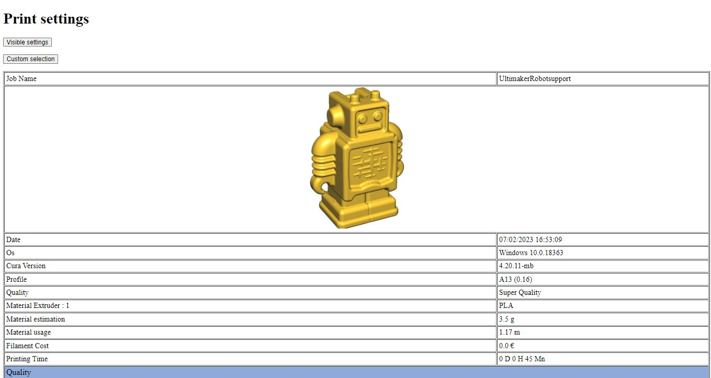

# Cura Settings HTML Export

Cura Plugin for Exporting Settings to an HTML file.

Initial Source from Johnny Matthews :  <https://github.com/johnnygizmo/CuraSettingsWriter>
Further development by 5axes: <https://github.com/5axes/CuraSettingsWriter>

It creates an extra menu option under File -> "Save Project..." that allows you to save all of the settings to an HTML file for review/sharing. 

Hereafter a sample screenshot of what you get as result.

## Status
Kinda new at this. Trying to get it work with current versions of Cura.
